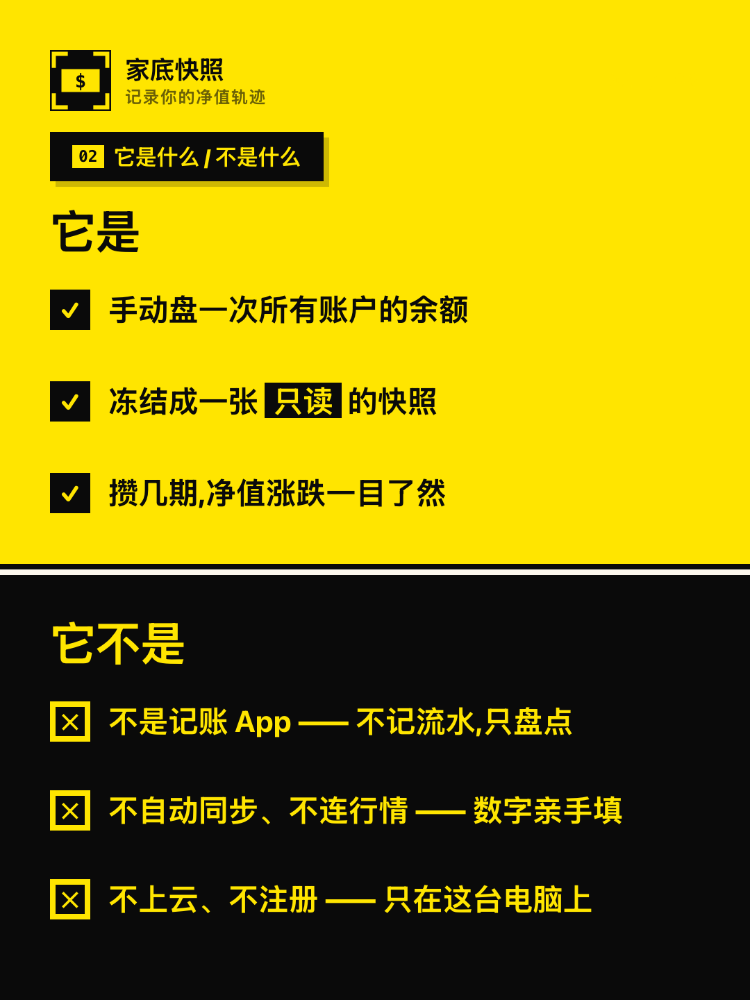

# 家底快照

> 记录你的净值轨迹

一个**只跑在本机**的资产盘点工具：定期给资产拍「快照」，看清总额、结构与收益随时间怎么变。

- **数据不出本机** —— 单端口服务，不联网、不上传、没有账号体系
- **一个地址搞定** —— 网页与接口由同一个 Node 进程提供，不需要理解「前端 / 后端」
- **拷走一个目录就能搬家** —— 全部数据、令牌、备份都在 `./.data/`

> **在线试用（只读演示）** —— <https://carson-lianng.github.io/asset-snapshot-site/try/>

<table>
  <tr>
    <td align="center" width="33%"><br><sub><b>①</b> 账户散落是常态 —— 不是你记性差</sub></td>
    <td align="center" width="33%"><br><sub><b>②</b> 它是什么 / 不是什么</sub></td>
    <td align="center" width="33%"><br><sub><b>③</b> 适合谁 —— 中两条以上就是给你做的</sub></td>
  </tr>
  <tr>
    <td align="center"><br><sub><b>④</b> 快速上手 —— 4 步，3 分钟</sub></td>
    <td align="center"><br><sub><b>⑤</b> 配套技能（独立交付）：盘点丢给 Agent 自动录入</sub></td>
    <td align="center"><br><sub><b>⑥</b> 配套技能（独立交付）：对 Agent 说人话，分析资产配置</sub></td>
  </tr>
</table>

---

## 目录

- [快速开始](#快速开始)
- [数据在哪里](#数据在哪里)
- [备份与恢复](#备份与恢复)
- [导入与导出](#导入与导出)
- [演示数据与「开始正式记账」](#演示数据与开始正式记账)
- [配置](#配置)
- [常用命令](#常用命令)
- [常见问题](#常见问题)
- [风险与边界](#风险与边界)
- [预构建包里有什么](#预构建包里有什么)
- [许可](#许可)

## 快速开始

**运行前提**：Node.js **≥ 22.18**（在终端执行 `node -v` 自检；不满足请到 [nodejs.org](https://nodejs.org) 装 LTS 版）。

```bash
npm ci --omit=dev   # 安装运行依赖（首次运行前执行一次）
npm start           # 启动，并自动打开浏览器
```

> 上面两条对**预构建包**（已含网页产物）即可开箱运行，不需要 `npm run build`。
> 从**源码仓库**运行则先多一步：`npm install && npm run build` —— 构建产物不在仓库里。

`npm start` 会打印一个**带令牌的地址**：

```
  家底快照已启动（仅本机可访问）
  http://127.0.0.1:5188/#t=<你的令牌>
```

几点要知道的：

- **必须用这个完整地址访问**（含末尾的 `#t=...`）。直接打开 `http://127.0.0.1:5188/` 只会看到
  「需要访问令牌」的引导页 —— 令牌是接口的准入凭证，走地址片段传递，不会发给服务端、也不进日志。
- **把这个完整地址存成书签**。端口固定在 5188，令牌保存在 `.data/.token`，**重启都不会变**，书签长期有效。
- 服务只监听 `127.0.0.1`，同网段的其它设备访问不到；改成绑定其它地址会在启动时直接报错退出。

## 数据在哪里

一切都在 `./.data/`：

| 路径 | 内容 |
|---|---|
| `.data/data.sqlite` | 全部业务数据（账户、快照、明细、汇率、字典） |
| `.data/.token` | 访问令牌（权限 0600，重启不变） |
| `.data/backups/backup-YYYY-MM-DD.sqlite` | 每日自动备份，保留最近 30 份 |
| `.data/backups/pre-restore-*.sqlite` | 每次恢复**之前**的兜底备份，保留最近 3 份 |

**搬家 / 换机器 = 拷走整个 `./.data/` 目录。** 数据目录可以用 `DATA_DIR` 指到别处
（例如随云盘同步的目录）。

## 备份与恢复

### 自动备份

两个时机各备一次，都是整库在线备份，**不用你记得**：

1. **当天第一次启动**后；
2. **每次成功保存快照**后（`BACKUP_ON_SNAPSHOT=false` 可关掉这一条）。

同日只保留一份（`backup-2026-10-04.sqlite`），超过 `BACKUP_KEEP`（默认 30）份后自动清理最旧的。
清理只认 `backup-YYYY-MM-DD.sqlite` 这个名字，目录里的其它文件不会被误删。

### 手动备份与还原

在界面的 **设置 → 备份恢复**：

- **立即备份** / 导出当前备份文件（下载一份 `.sqlite`）
- **从此备份恢复** / **从 JSON 文件恢复** —— 两者都会二次确认，并复述「当前 N 个账户与 M 期快照会被替换」
- 恢复前会自动留一份 `pre-restore-*.sqlite`，把「不可逆」变成「可退回」。**这个文件名会在提示里显示，记一下。**

恢复是唯一会**整库替换**的操作，有两道保护：备份文件的 `schema_version` 高于当前程序 → 明确报错并终止
（不会「尽力而为」地导入一半、也不会静默丢字段）；中途失败 → 整体回滚，原数据完好无损。

## 导入与导出

在界面的 **设置 → 导入导出**：

- **导出全量备份（JSON）** —— 与「恢复」完全对偶，可当作跨版本迁移用的格式
- **导出明细 CSV / 汇总 CSV** —— 带 UTF-8 BOM，Excel 直接打开不乱码
- **导入 CSV** —— 用来批量建账户档案，会先给出差异预览（新增 / 更新 / 冲突 / 跳过），确认后才写入

> **导入只写账户档案，不写余额。** CSV 里的金额会被读出来显示在预览里，但不会入库 ——
> 余额必须经过盘点向导（三态、冻结汇率、门禁），否则会产出一张来路不明的快照。
> 存在「冲突」行时整批拒绝，而不是跳过冲突、静默导入其余部分。

## 演示数据与「开始正式记账」

首次使用会灌入**演示数据**（22 个账户、7 期快照），方便先看清界面长什么样，可以随便改着试。

准备好记自己的账时，界面顶部会出现一条黄色提示条，点 **开始正式记账**：

- 清空演示的账户与快照；
- **保留**币种 / 汇率 / 平台 / 分类 / 标签（记账要用的字典，清掉反而得重建）；
- 之后提示条消失。

命令行的等价入口：`npm run reset -- --yes`。
演示数据不会丢，随时可以灌回来：`npm run db:seed -- --yes`。

想清空**自己的**账本重新开始，也走 `npm run reset -- --yes` —— 界面上没有这个按钮，
因为一次误点的代价太大，而它一年也用不到一次。

## 配置

配置读同目录下的 `.env`（首次可从 `.env.example` 复制一份）：

```bash
cp .env.example .env
```

使用者最常改的几项：

| 变量 | 默认值 | 说明 |
|---|---|---|
| `PORT` | `5188` | 监听端口。`0` = 每次由系统随机分配（地址会变，不便收藏） |
| `DATA_DIR` | `.data` | 数据目录（留空 = 包内 `./.data/`） |
| `OPEN_BROWSER` | `true` | 启动后自动打开浏览器 |
| `BACKUP_KEEP` | `30` | 保留最近多少份每日备份（下限 1） |
| `BACKUP_ON_SNAPSHOT` | `true` | 每次成功保存快照后是否再自动备份一次 |
| `HOST` | `127.0.0.1` | 只允许回环地址；绑定其它地址会在启动时直接报错退出 |

**临时覆盖不必改文件**，环境变量优先于 `.env`：

```bash
PORT=5199 npm start           # 临时换端口
DATA_DIR=~/asset npm start    # 临时换数据目录
```

## 常用命令

| 命令 | 作用 |
|---|---|
| `npm start` | 启动（本包已含网页产物，开箱可用） |
| `npm run reset -- --yes` | 清空账本（保留字典） |
| `npm run db:seed -- --yes` | 灌回演示数据（整库覆盖） |
| `npm run build` | 重新构建网页产物（**需先完整安装依赖 `npm install`**，只在改了前端源码时用） |
| `npm run dev` | 开发态：前端热更新 + 接口，两个进程 |
| `npm run db:migrate` | 执行数据库迁移（升级版本时用） |

## 常见问题

**Q：浏览器提示「需要访问令牌」，打不开界面？**
用启动横幅里**完整的那条地址**（末尾带 `#t=...`）。令牌没有丢，只是没带上。

**Q：忘了令牌怎么办？**
重启一次，启动横幅会重新打印；也可以直接看 `.data/.token` 文件。

**Q：端口 5188 被占用，起不来？**
`PORT=5199 npm start` 换个端口即可（地址里的端口跟着变）。

**Q：想换台电脑继续用？**
把整个 `.data/` 目录拷过去，在新机器上 `npm ci --omit=dev && npm start`。

**Q：数据会不会被上传到什么地方？**
不会。服务只监听本机回环地址、不发起外部请求；数据全部在 `./.data/` 里。

**Q：能多人同时用吗？**
不能，这是**单机单用户**设计：没有多用户与权限体系。也**不要**把服务绑定到 `0.0.0.0`。

## 风险与边界

- ⚠️ **备份与主库在同一块盘上。** 备份能挡住误删、误操作、程序错误，但**挡不住整盘故障或整个目录被删**。
  → 养成习惯：定期把 `.data/backups/` 里最新的那份拷到别处（移动硬盘 / 云盘），
  或者把 `DATA_DIR` 直接指到一个会被同步的目录。
- 令牌是本机接口的唯一凭证，**不通过环境变量配置**、也不入库；它只出现在启动横幅（与 `.data/.token`）里。
- 该服务面向本机个人使用，不建议暴露到公网。

## 预构建包里有什么

> 下面是**预构建包**的目录结构。**源码仓库**的结构以仓库页为准：不含构建产物
> （`app/web/dist/`，需自己 `npm run build`），另含开发与验收工具链。

```
├── app/                应用源码（server / web / domain / shared）+ 运行入口
│   ├── web/dist/       已构建好的网页产物（开箱即用）
│   ├── fixtures/       演示数据（运行时依赖）
│   └── tools/run/      启动脚本
├── docs/images/        README 插图（产品海报 6 页，上图）
├── .env.example        配置样例（复制成 .env 后生效）
├── package.json        运行脚本与依赖声明
├── package-lock.json   依赖版本锁定
├── tsconfig*.json      TypeScript 配置
├── LICENSE             开源许可（MIT）
└── README.md           本文档
```

两点请**不要**自行清理：

- **`app/web/src/features/help/`** —— 界面里「使用手册」页的正文来源，删掉会让手册页空白。
- **`app/fixtures/demo-seed.json`** —— 首次启动的演示数据来源，**是运行时依赖**；删掉后库为空时不再有演示数据。

## 许可

本项目以 **MIT 许可**开源，全文见 [LICENSE](LICENSE)：可自由使用、修改、分发，允许商业用途，
条件是保留版权声明与许可声明。

Copyright (c) 2026 家底快照
